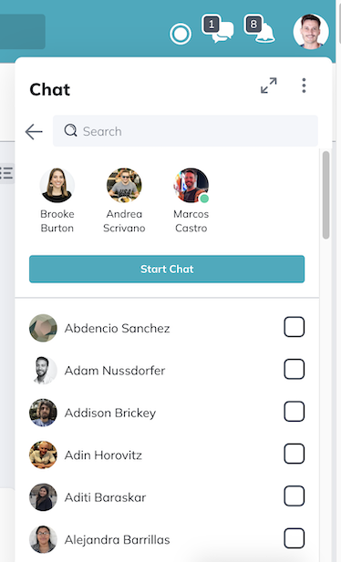
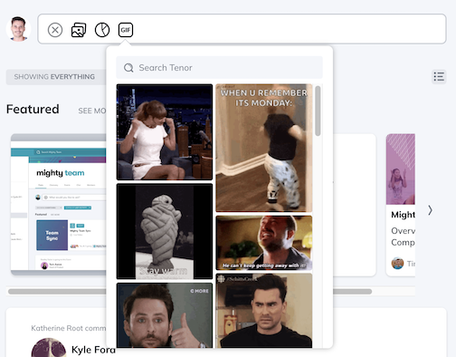

## Overview

During my time at Mighty Networks I worked as a Fullstack developer (with a focus on the Front End), coming from the React world into an older tech stack which challenged me to learn technologies such as Backbone, Marionette JS, Coffeescript and Ruby on Rails. As the company's plans for migrating towards React gained traction I was able to contribute with some new React-based components and thorough unit testing through Jest.

## Highlights

These are just a few of the projects I've worked on:

### Group Chat

Enabling group chats (n to n conversations) between users on the platform.

### Chat Prompt

The Chat Prompt was the result of working on a long-living migration project that enabled the chat input mechanics to benefit from inputting logic of other parts of the platform.

### GIF Picker

The GIF Picker project was entirely done in React. To do this, I had to create some building blocks that would later be reused by other developers, such as the Popup component and the MasonryLayout (to display the GIFs) among others.

This new GIF Picker component would now be able to be integrated to all inputting areas of the platform, including the chat view, thanks to the previous refactoring work done in the Chat Prompt project.

### Integration of AI features

During this project I contributed to the implementation of some AI features into the platform such as _Assisted article creation_ and several inline assistants to improve text inputting (like _changing tone_, _improving grammar_, _expanding a text selection_, _improving readability_, etc).

### GA4 migration

Migration from Universal Analytics to Google Analytics 4, which implied a large refactor of our MN's own Analytics implementation and a carefully designed flow to allow users to smoothly transition their own tracking properties.

### Cookie consent banner

The Cookie Consent Banner was an important project to make sure the platform conformed to GDPR and CCPA regulations. The front end piece (the banner itself and configuration options for it) was implemented by means of a dedicated library while the back end aspect was done in Ruby on Rails.

### Custom email domains

The Custom Email Domains project allowed the platform to support multiple email domains. This was done through the use of the Mailgun API and involved a carefully designed warm up process for our customers custom email domains.

## Conclusion

Working on Mighty Network was an exciting ride, with plenty of opportunities to learn and grow both technically and as a team player.
