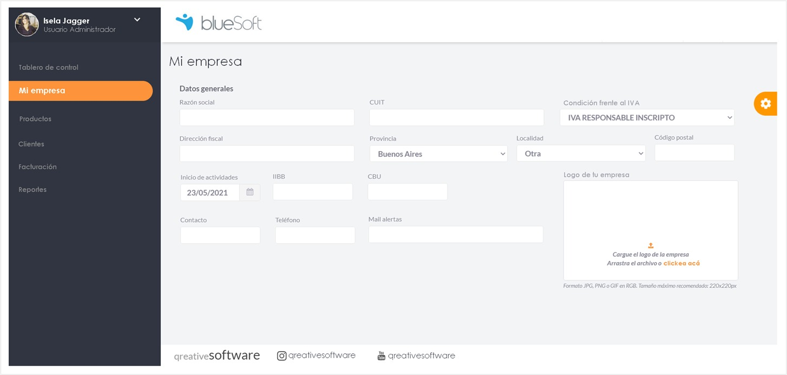
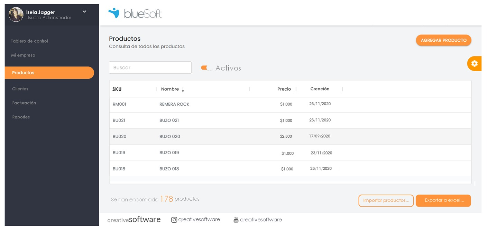

My contributions specifically focused on building the front-end of the web version. This involved crafting the user interface, ensuring a smooth and intuitive user experience, and implementing the necessary code to make it all function reliably.

